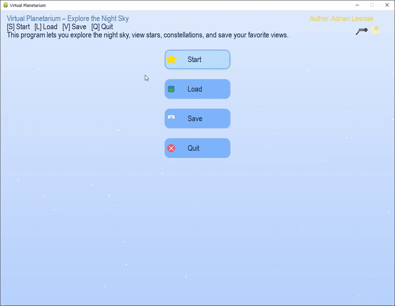

# 🌟🔭 SkyGazer: Python Interactive Virtual Planetarium 🌌
_A Python-based interactive desktop application that allows users to explore a simulated night sky, view constellations, get star information, and customize their viewing experience._

[](https://opensource.org/licenses/MIT)
[](https://www.python.org/)

## 📋 Table of Contents
1.  [Overview](#-overview)
2.  [Key Features](#-key-features)
3.  [Interactive Controls](#-interactive-controls)
4.  [Screenshots (Conceptual)](#-screenshots-conceptual)
5.  [System Requirements & Dependencies](#-system-requirements--dependencies)
6.  [Configuration (`config.json`)](#-configuration-configjson)
7.  [Installation](#️-installation)
8.  [Running the Application](#️-running-the-application)
9.  [File Structure (Expected)](#-file-structure-expected)
10. [Contributing](#-contributing)
11. [License](#-license)
12. [Author & Contact](#-author--contact)

## 📄 Overview

**SkyGazer: Python Interactive Virtual Planetarium**, developed by Adrian Lesniak, is a modern desktop application that brings the wonders of the night sky to your screen. This Python-based tool simulates an interactive star map with real-time position calculations for 40+ of the brightest stars. Users can explore constellations, get detailed information about stars by hovering, and navigate the cosmos using advanced zoom and pan functionalities. The application features a beautiful, customizable interface, a vertical side menu for all actions, and supports saving/loading custom sky views.

<br> 
<p align="center">
  
</p>
<br>


## ✨ Key Features

*   🗺️ **Interactive Star Map**:
    *   Displays a dynamic map of the night sky with 40+ of the brightest stars.
    *   Real-time or simulated positions of stars and constellations.
*   ✨ **Constellation Visualization**:
    *   Clearly draws and labels major constellations.
*   ℹ️ **Star Information on Hover**:
    *   Hover over a star to see a pop-up with its name, magnitude, and distance.
*   🔍 **Advanced Zoom & Pan**:
    *   Zoom in/out with the mouse wheel, centered on the cursor position for intuitive navigation.
    *   Pan the sky by dragging with the mouse.
*   🎨 **Modern, Customizable Interface**:
    *   Beautiful gradient backgrounds, animated stars, and a vertical side menu for all actions.
    *   Switch between day/night mode with a single button.
    *   All colors, fonts, and window size are customizable via `config.json`.
*   💾 **Save & Load Custom Views**:
    *   Save your favorite sky view (date, location, zoom, pan) and load it later from the side menu.
*   🖼️ **Export View**:
    *   Export the current sky view as a PNG image with one click.
*   🌌 **Real-Time or Simulated Sky**:
    *   Set any date/time/location for the sky simulation.
*   🖱️ **Intuitive Controls**:
    *   All actions (save, load, export, day/night, back to menu) are available in the always-visible side menu.
*   🛡️ **Cross-Platform**:
    *   Works on Windows, macOS, and Linux (requires Python 3.x and dependencies).

## 🕹️ Interactive Controls

*   **Mouse Wheel**: Zoom in/out (centered on cursor)
*   **Left Mouse Button**: Pan the sky (drag), click side menu buttons
*   **Mouse Hover**: Show star info pop-up
*   **ESC**: Back to main menu
*   **D**: Toggle day/night mode
*   **Side Menu**: Save, Load, Export, Back, Day/Night

## 🖼️ Screenshots (Conceptual)

<p align="center">
  
  
  
  
  
  
</p>


## ⚙️ System Requirements & Dependencies

### Software:
*   **Python**: Python 3.x (3.8 or higher recommended).
*   **Libraries** (see `requirements.txt`):
    *   `pygame==2.5.1` (GUI, graphics, events)
    *   `skyfield==1.46` (astronomical calculations)
    *   `pandas==2.1.1` (star catalog loading)

### Operating System:
*   Windows, macOS, or Linux (Python 3.x and dependencies required).

## ⚙️ Configuration (`config.json`)

Customize the application's appearance and behavior by editing `config.json`:

```json
{
  "colors": {
    "background": [0, 0, 30],
    "text": [255, 223, 0],
    "highlight": [100, 149, 237],
    "star": [255, 255, 255]
  },
  "window": {
    "width": 1200,
    "height": 900,
    "title": "Virtual Planetarium - by Adrian Lesniak"
  },
  "font": {
    "size": 16,
    "name": "Arial"
  }
}
```

# 🌌 SkyGazer: Python Virtual Planetarium

## 🛠️ Installation

### Ensure Python 3.x is Installed

```bash
python --version
# or
python3 --version
```

If not installed, download from [python.org](https://www.python.org/).

### Clone the Repository

```bash
git clone <repository-url>
cd <repository-directory>
```

_Replace `<repository-url>` and `<repository-directory>` with your actual project details._

### Set Up a Virtual Environment (Recommended)

```bash
python -m venv venv
source venv/bin/activate  # On Windows: venv\Scripts\activate
```

### Install Required Libraries

With the virtual environment activated, install the dependencies:

```bash
pip install -r requirements.txt
```

---

## ▶️ Running the Application

Navigate to the project directory in your terminal (where `main.py` is located).  
Ensure your virtual environment is activated (if you created one).

Run the application:

```bash
python main.py
# or if using python3 alias:
python3 main.py
```

The **SkyGazer Virtual Planetarium** window should open, displaying the interactive star map.

---

## 🗂️ File Structure (Expected)

```plaintext
main.py               # Main script with GUI, logic, rendering, and events
config.json           # User-configurable settings (colors, size, fonts)
requirements.txt      # Dependency list
data/                 # Star catalog and constellation data
celestial_objects.py  # Star/planet/constellation definitions
constellations.py     # Constellation line data
astro_logic.py        # Astronomical calculations
utils/                # Logger and helpers
LICENSE               # MIT License
README.md             # Project documentation
screenshots/          # Example screenshots
```

---

## 📝 Technical Notes

- **GUI Library**: Pygame for real-time rendering and interaction.
- **Astronomical Data**: Loaded from CSV (40+ brightest stars) and constellation files.
- **Coordinate Systems & Projections**: Transforms celestial coordinates (RA/Dec) into screen space.
- **Performance**: Optimized for real-time rendering and smooth interaction.
- **Data Export**: Export current view as PNG from the side menu.
- **Cross-Platform**: Works on Windows, macOS, Linux.

---

## 🤝 Contributing

Contributions to **SkyGazer: Python Virtual Planetarium** are welcome!

Ideas for contributions:

- Add more celestial bodies (planets, galaxies, nebulae)
- Improve astronomical models and accuracy
- Enhance visuals (brightness, color, atmosphere)
- Add UI/UX improvements or controls
- Implement search, time controls, or educational overlays
- Optimize performance

### How to Contribute

```bash
# Fork the repository
# Create a new feature branch
git checkout -b feature/PlanetRendering

# Make your changes
# Commit your changes
git commit -m 'Feature: Add rendering of planets with orbits'

# Push to GitHub
git push origin feature/PlanetRendering

# Open a Pull Request
```

Please follow best practices:

- Comment your code
- Follow PEP 8
- Use type hints where useful

---

## 📃 License

This project is licensed under the **MIT License**.  
See the `LICENSE` file for full terms.

---

## 👤 Author & Contact

Application concept by **Adrian Lesniak**.

For questions, feedback, or issues, please:

- Open an [issue](../../issues) in this repository
- Or contact the repository owner

---

> ✨ Explore the cosmos from your desktop with SkyGazer – your Python-powered planetarium!
